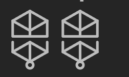
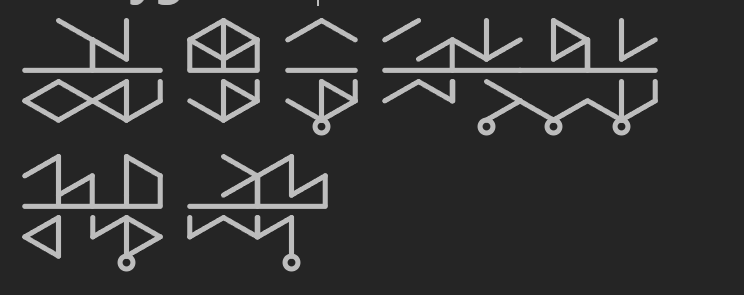

# Obsidian Tunic Plugin
This is an Obsidian plugin for rendering glyphs from the puzzle game [Tunic](https://store.steampowered.com/app/553420/TUNIC/).

## How to use
The plugin uses custom codeblocks in order to render glyphs, based on a 'complete' glyph:


which corresponds to the following ascii code:
```
<|>
|||
---
| |
<|>
o
```
which is encoded as follows in obsidian:
```
<|>|||-||<|>o
```
replace any part in that glyph with an `x` in order to exclude it from rendering.

You may also have several glyphs in a single codeblock, if you separate glyphs with a `,`, they will be 'merged' appearing sharing the left/right vertical lines. If you separate them with a `␣`, they'll have a small space between them. Lastly, if you separate them with a `,␣` and, they'll have a large space between them. `␣` refers to a space.

The codeblocks must use the `tunic-lang` language in order to render correctly. For example:<br>
\`\`\`tunic-lang<br>
<|>|||-||<|>o<br>
\`\`\`<br>
## Examples

### No Space
```tunic-lang
<|>|||-||<|>o,<|>|||-||<|>o,<|>|||-||<|>o,<|>|||-||<|>o,<|>|||-||<|>o,<|>|||-||<|>o
```


### Small Space
```
<|>|||-||<|>o <|>|||-||<|>o
```


### Large Space
```
<|>|||-||<|>o, <|>|||-||<|>o
```


### Complex
```
xx\xx|-xx<x>x,\|x|xx-x|<|/x <|>|||-x|\|>x /x\xxx-x|\|>o /x/xx|-x|/x\x,\|/xxx-|xxx>o,x|>xx|-xx\x/o,x|/|xx-x|\|/o
/|/x||-xx<|xx,x|\x||-|x/|>o xx>xx|-||/x\x,/|/|x|-|x/|xo
```

